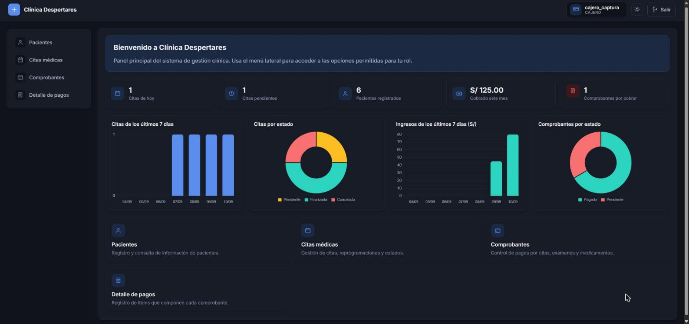
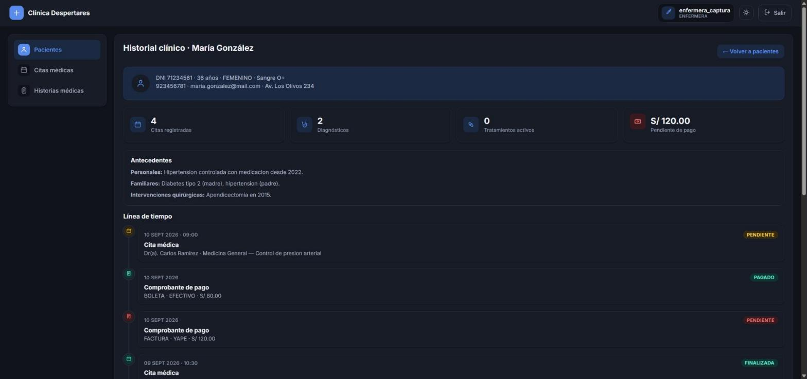

# Clínica Despertares

[](https://github.com/luis1078/clinica-despertares-IS3/actions/workflows/ci.yml)


Sistema de gestión clínica (Spring Boot 3.5 + Thymeleaf + PostgreSQL): historias
clínicas, citas, diagnósticos, tratamientos, exámenes de laboratorio e
imágenes, comprobantes de pago, inventario de medicamentos y control de
acceso por rol para seis perfiles de personal distintos.

## Funcionalidades

- **Historial clínico unificado**: línea de tiempo por paciente que combina
  citas, diagnósticos, exámenes, tratamientos y pagos en un solo lugar
  (`Service/HistorialClinicoServiceImpl`).
- **Panel principal con gráficos** (Chart.js): indicadores y gráficos propios
  para cada rol — citas por día/estado para el personal clínico, ingresos y
  comprobantes para caja, diagnósticos por gravedad para el médico, stock de
  medicamentos para farmacia.
- **Control de acceso por rol**: `CAJERO`, `MEDICO`, `ENFERMERA`,
  `FARMACEUTICO`, `BIOLOGO`, `RADIOLOGO`, cada uno con su propio subconjunto
  de menú y permisos (`Config/AuthInterceptor.java`).
- CRUD completo de los 15 módulos del dominio, todos con búsqueda y paginación.
- Modo oscuro con detección automática del sistema + toggle manual persistido.
- Contraseñas con hash, protección CSRF en toda escritura, y borrados por POST.
- Datos de ejemplo al arrancar con la base vacía (`Config/DataSeeder.java`).
- Suite de tests (JUnit 5 + Mockito) corriendo en CI en cada push.

## Capturas





*(Si no las ves: ver [docs/screenshots/README.md](docs/screenshots/README.md) para generarlas.)*

## Opción A — Todo con Docker (recomendado)

Solo necesitas **Docker Desktop**. No hace falta JDK, Maven ni Postgres instalados en tu máquina.

```powershell
docker compose up -d --build
```

Esto construye la imagen de la app (multi-stage: compila con Maven Wrapper dentro del contenedor y deja solo el JAR + JRE 21 en la imagen final) y levanta dos contenedores:

- `isw2-postgres`: PostgreSQL 16 en el puerto `5432`.
- `isw2-app`: la aplicación en el puerto `8080`, que espera a que la base de datos esté healthy antes de arrancar.

Hibernate crea el esquema solo (`spring.jpa.hibernate.ddl-auto=update`) — no hay scripts SQL que correr a mano. La app queda en **http://localhost:8080** — la primera pantalla es `/login`, desde ahí puedes registrar una cuenta nueva.

Los datos de Postgres quedan en un volumen con nombre (`isw2_postgres_data`), así que sobreviven a `docker compose down` (solo se pierden si además borras el volumen con `-v`).

```powershell
docker compose logs -f app   # ver logs de la app
docker compose down          # parar todo
docker compose up -d --build # reconstruir tras cambiar código
```

## Opción B — Base de datos en Docker, app en local (para desarrollar)

Útil si vas a modificar código seguido: con `mvnw spring-boot:run` los cambios se recompilan más rápido que reconstruyendo la imagen cada vez.

### Requisitos

- **JDK 21** (no funciona con JDK 25+: Lombok no genera getters/setters y falla la compilación en silencio).
  Si no tienes uno, instala [Temurin 21](https://adoptium.net/temurin/releases/?version=21) y define `JAVA_HOME` apuntando ahí.
- **Docker Desktop** (solo para la base de datos).

No hace falta instalar Maven: el proyecto trae `mvnw` / `mvnw.cmd` (Maven Wrapper), que descarga Maven solo la primera vez que lo usas.

### 1. Levantar la base de datos

```powershell
docker compose up -d db
```

Usa los mismos usuario/clave/BD que ya trae `application.properties` por defecto (`postgres` / `password` / `postgres`) — no hace falta tocar nada más.

### 2. Levantar la aplicación

```powershell
$env:JAVA_HOME = "C:\ruta\a\tu\jdk-21"
$env:Path = "$env:JAVA_HOME\bin;" + $env:Path

.\mvnw.cmd spring-boot:run
```

La app queda en **http://localhost:8080**.

### Otros comandos útiles

```powershell
.\mvnw.cmd clean compile     # solo compilar
.\mvnw.cmd test              # correr los tests (los de Service.ServiceImpl no requieren BD; ClinicaDespertaresApplicationTests sí, porque levanta el contexto completo de Spring)
.\mvnw.cmd clean package      # generar el .jar en target/
```

## Configuración por variables de entorno (para otros entornos, no local)

`application.properties` lee estas variables si están definidas, y si no, usa los valores de desarrollo local:

| Variable | Default local |
|---|---|
| `DB_URL` | `jdbc:postgresql://localhost:5432/postgres?stringtype=unspecified` |
| `DB_USERNAME` | `postgres` |
| `DB_PASSWORD` | `password` |

## Roles del sistema

`CAJERO`, `MEDICO`, `ENFERMERA`, `FARMACEUTICO`, `BIOLOGO`, `RADIOLOGO` — cada uno ve un subconjunto distinto del menú según permisos definidos en `Config/AuthInterceptor.java`.
